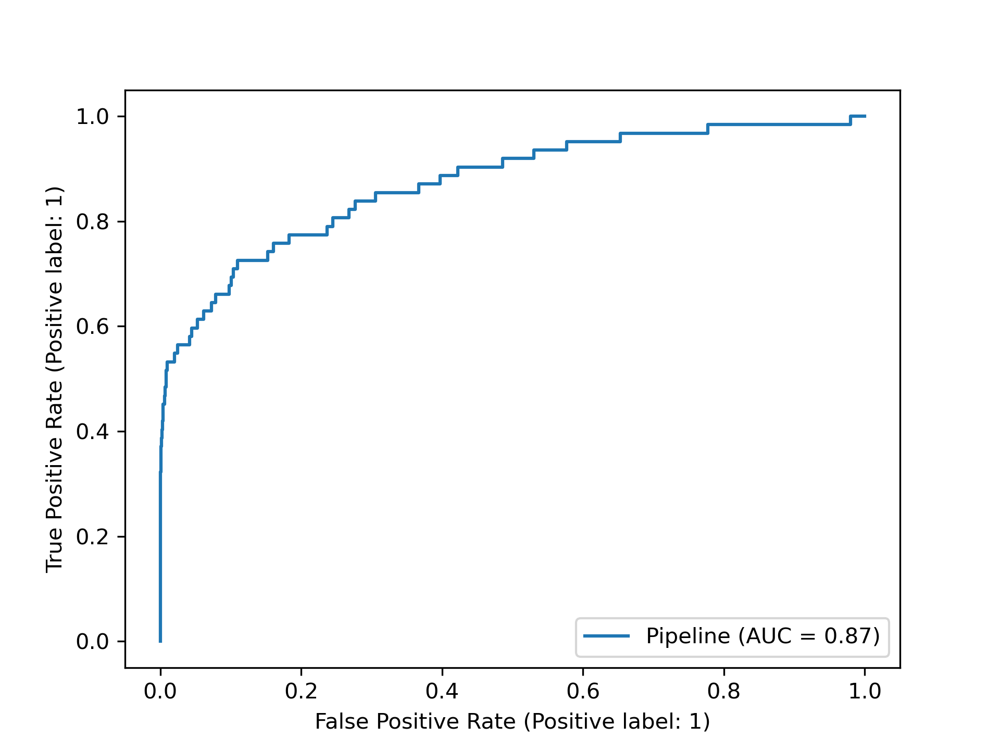

# Car insurance fraud project   💸🚗🕵️‍♂️

Small fraud prediction project for the course Advanced Analytics @ KULeuven. Logistic Regression is used to predict whether a car insurance claim is fraudulent or not. *preprocessing.py* creates features from the raw data. *lr_classification.py* returns the classification performance on a stratified test set constituing 20% of the original dataset.

## Results 

| Metric | Score |
| --- | --- |
| Precision |  4 |
| Recall |  73 |
| F1 |   7  |
| AUC   |   80.75  |

**ROC Curve**
  

